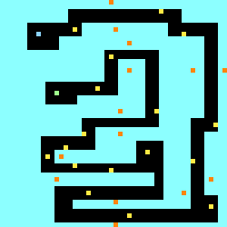

# spel

# concept:
nick:

ilya:

# het idee
je bent een auto op een vliegende race baan.
je hebt 20 seconde om naar het einde te komen, door de muntjes te pakken krijg je extra tijd.
er komen elke 5 seconden een haai over de baan springen. als die je aan raakt val je van de baan.
als je bij het einde komt dan win je.

1. Hoe communiceer ik dat de speler kan bewegen?
???

2. Hoe communiceer ik wat het doel van het level is?
door de text op het scherm

3. Hoe communiceer ik wat gevaarlijk is?
de haaien zien er eng uit